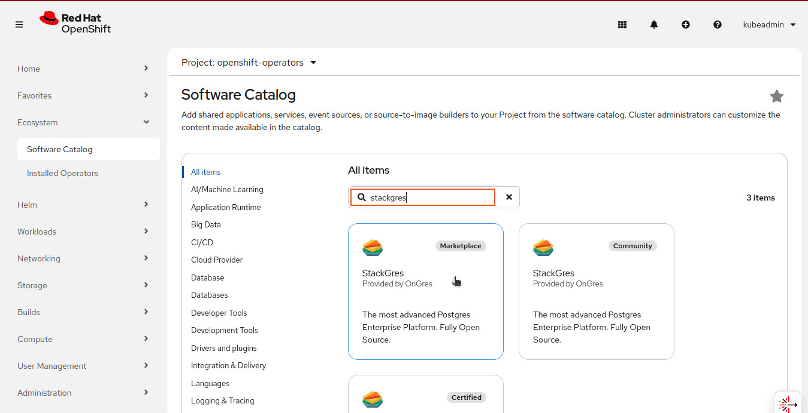
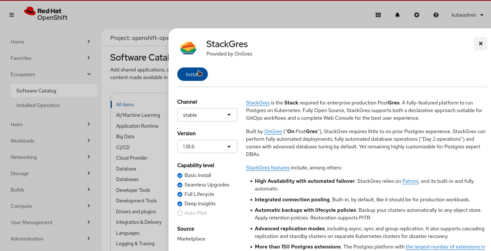
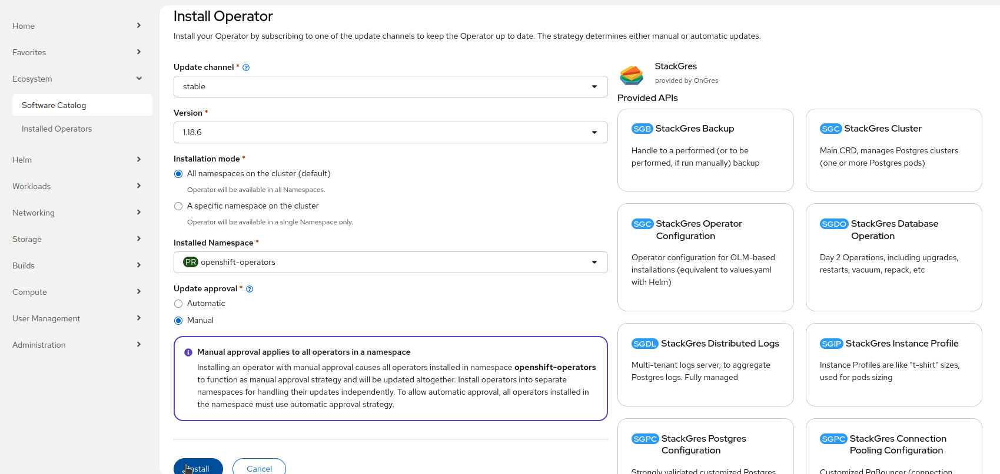
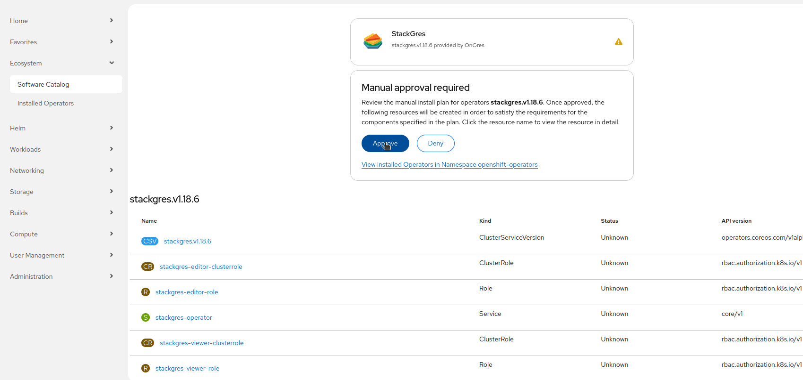
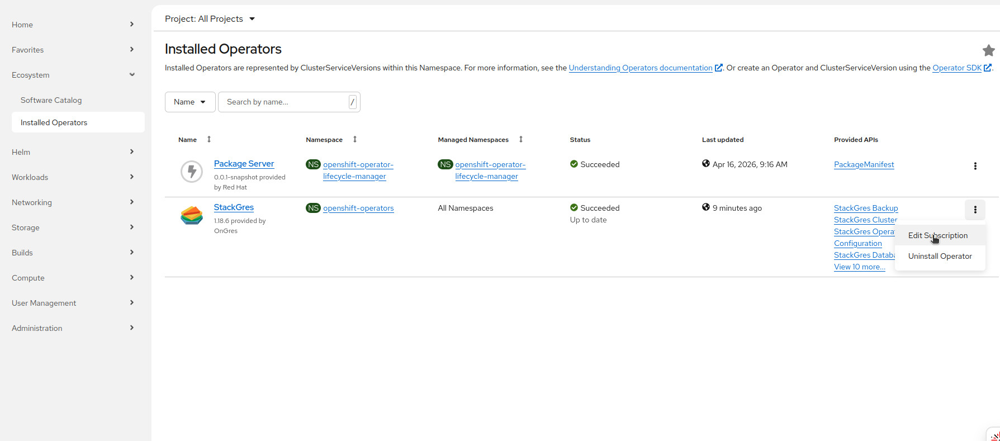
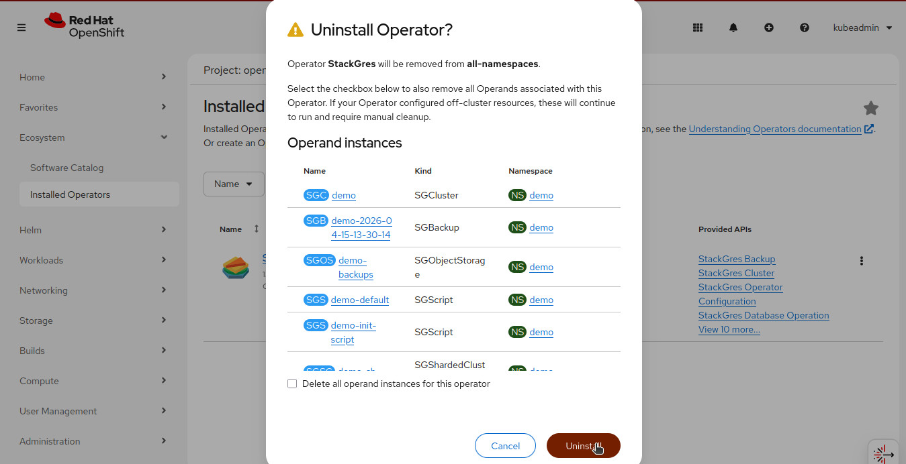

The StackGres operator can be installed via OperatorHub using the OLM ([Operator Lifecycle Manager](https://olm.operatorframework.io/)) that should already be installed in your Kubernetes cluster.
On this page, we are going through all the necessary steps to set up a production-grade StackGres environment.

## Installation via OperatorHub

StackGres (the operator and associated components) may be installed by creating the namespace, an operator group, and a subscription.

```
cat << EOF | kubectl create -f -
apiVersion: v1
kind: Namespace
metadata:
  name: stackgres
---
apiVersion: operators.coreos.com/v1
kind: OperatorGroup
metadata:
  name: stackgres
  namespace: stackgres
---
apiVersion: operators.coreos.com/v1alpha1
kind: Subscription
metadata:
  name: stackgres
  namespace: stackgres
spec:
  channel: stable 
  name: stackgres 
  source: operatorhubio-catalog
  sourceNamespace: olm
  installPlanApproval: Manual
EOF
```

> You can specify the version in the startingCSV field. For example, you may set it to `stackgres.v1.0.0` to install version `1.0.0`.

The field `installPlanApproval` is set to `Manual` to prevent automatic upgrades of the operator in order to avoid having the operator upgraded before the StackGres custom resources are upgraded to the latest version (for more info see the [upgrade section]({})).

To proceed with the installation you will have to patch the `InstallPlan` that has been created by the OLM operator:

```shell
INSTALL_PLAN="$(kubectl get -n stackgres installplan -o name)"
kubectl patch -n stackgres "$INSTALL_PLAN" --type merge -p 'spec: { approved: true }'
kubectl wait -n stackgres "$INSTALL_PLAN" --for condition=Installed
```

The installation may take a few minutes.

Finally, the output will be similar to:

```plain
installplan.operators.coreos.com/install-66964 patched
installplan.operators.coreos.com/install-66964 condition met
```

Modify the configuration by patching the StackGres SGConfig

```shell
cat << EOF | kubectl patch -n stackgres sgconfig stackgres-operator --type merge -p "$(cat)"
spec:
  grafana:
    autoEmbed: true
    secretName: prometheus-operator-grafana
    secretNamespace: monitoring
    secretPasswordKey: admin-password
    secretUserKey: admin-user
    webHost: prometheus-operator-grafana.monitoring
  adminui:
    service:
      type: LoadBalancer
EOF
```

Or modify the configuration by patching the StackGres subscription and adding or modifying the environment variable `SGCONFIG`:

```shell
cat << EOF | kubectl patch -n stackgres subscription stackgres --type merge -p "$(cat)"
spec:
  config:
    env:
    - name: SGCONFIG
      value: |
        spec:
          grafana:
            autoEmbed: true
            secretName: prometheus-operator-grafana
            secretNamespace: monitoring
            secretPasswordKey: admin-password
            secretUserKey: admin-user
            webHost: prometheus-operator-grafana.monitoring
          adminui:
            service:
              type: LoadBalancer
EOF
```

You may also set other environment variables that control the operator behavior and that can not
 be set by modifying the SGConfig resource. See also the [SGConfig reference documentation]({}).

> In some managed Kubernetes clusters and Kubernetes distributions a LoadBalancer may not be available, in such case replace `LoadBalancer` with `NodePort` and
>  you will be able to connect directly to the node port that will be assigned to the service. To retrieve such port use the following command:

```
kubectl get service -n stackgres stackgres-restapi --template '{{ (index .spec.ports 0).nodePort }}{{ printf "\n" }}'
```

### Installation on OpenShift 4.x

On OpenShift 4.x, the operator will be installed in the `openshift-operators` namespace so make sure to replace `stackgres` with `openshift-operators` in all the commands of this tutorial.

Since in OpenShift the namespace `openshift-operators` is already created you only need to create the Subscription:

```shell
cat << EOF | kubectl create -f -
apiVersion: operators.coreos.com/v1alpha1
kind: Subscription
metadata:
  name: stackgres
  namespace: openshift-operators 
spec:
  channel: stable 
  name: stackgres 
  source: redhat-marketplace
  sourceNamespace: openshift-marketplace
  installPlanApproval: Manual
EOF
```

To proceed with the installation follow the same steps as already explained in the [Installation via OperatorHub](#installation-via-operatorhub) but replacing the namespace with `openshift-operators`:

```shell
INSTALL_PLAN="$(kubectl get -n openshift-operators installplan -o name)"
kubectl patch -n openshift-operators "$INSTALL_PLAN" --type merge -p 'spec: { approved: true }'
kubectl wait -n openshift-operators "$INSTALL_PLAN" --for condition=Installed
```

Finally, the output will be similar to:

```plain
installplan.operators.coreos.com/install-66964 condition met
```

Modify the configuration by patching the StackGres SGConfig

```shell
cat << EOF | kubectl patch -n openshift-operators sgconfig stackgres-operator --type merge -p "$(cat)"
spec:
  grafana:
    autoEmbed: true
    secretName: prometheus-operator-grafana
    secretNamespace: monitoring
    secretPasswordKey: admin-password
    secretUserKey: admin-user
    webHost: prometheus-operator-grafana.monitoring
  adminui:
    service:
      type: LoadBalancer
EOF
```

Or modify the configuration by patching the StackGres subscription and adding or modifying the environment variable `SGCONFIG`:

```shell
cat << EOF | kubectl patch -n openshift-operators subscription stackgres --type merge -p "$(cat)"
spec:
  config:
    env:
    - name: SGCONFIG
      value: |
        spec:
          grafana:
            autoEmbed: true
            secretName: prometheus-operator-grafana
            secretNamespace: monitoring
            secretPasswordKey: admin-password
            secretUserKey: admin-user
            webHost: prometheus-operator-grafana.monitoring
          adminui:
            service:
              type: LoadBalancer
EOF
```

#### Installation via OpenShift Web Console

Alternatively you may install the StackGres Operator from the OpenShift Web Console by following these steps:

1. Search the StackGres Operator from the OperatorHub tab

>     

2. After selecting it click on the "Install" button

>     

3. Then use the All namespaces or specific namespace installation mode (depending on your requirements), set the manual update approval option and click on the "Install" button

>     

4. Accept the installation plan by clicking on the "Approve" button

>     

5. Optionally configure the Subscription by cliking on the "Edit Subscription" button and editing the YAML in the editor that will appear:

>     

## Migrate from global to scoped installation

When installing the operator you may chose to [install it globally or scoped to a set of namespaces](https://olm.operatorframework.io/docs/advanced-tasks/operator-scoping-with-operatorgroups) using OperatorGroup.

In some cases you may need to migrate from a global operator installation to a scoped operator installation. The operation is as easy as uninstalling the global operator and re-installing it as a scoped operator. Before proceeding make sure to create a backup of the Subscription YAML in order to be able to recover the `config` section when re-installing it.

> **IMPORTANT** If the namespace of the scoped operator installation changed you MUST also remove the `SGConfig` resource present in the namespace of the global operator before the uninstallation of the global operator.

### Migrate from global to scoped installation on OpenShift 4.x

Follow the same steps as explained in the [Migrate from global to scoped installation section](#migrate-from-global-to-scoped-installation).

### Migrate from global to scoped installation via OpenShift Web Console

1. From the OpenShift Web Console make sure that during uninstalling the global operator you do NOT check the box for "Delete all operand instances for this operator":

>     

> **IMPORTANT** If the namespace of the scoped operator installation changed you MUST also remove the `SGConfig` resource present in the namespace of the global operator before the uninstallation of the global operator.
